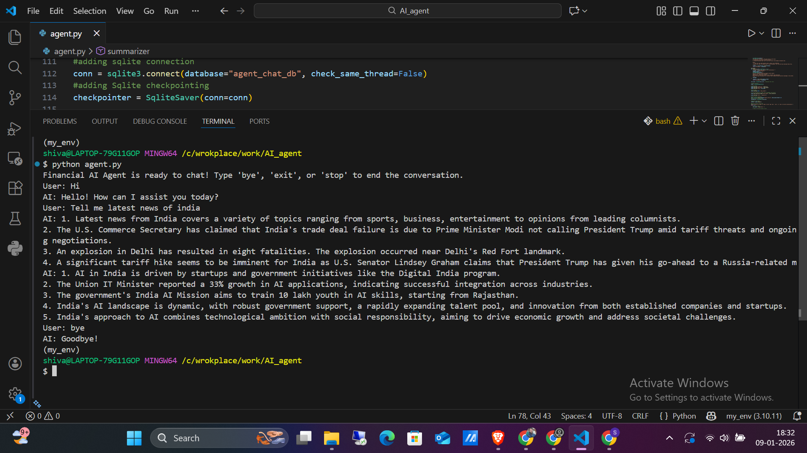

# Financial AI Agent

An intelligent conversational agent for financial market queries and analysis powered by OpenAI's GPT models and LangGraph.

## Overview

The Financial AI Agent is a multi-turn conversational system that leverages large language models (LLMs) to answer general queries and provide stock market sentiment in just 5 points. It uses a graph-based architecture with specialized LLM nodes and tool integration for real-time data fetching.

## Architecture

### System Components

```
┌─────────────────────────────────────────────────────────────┐
│                    User Input Loop                          │
│              (Interactive CLI Chat Interface)               │
└────────────────────┬────────────────────────────────────────┘
                     │
                     ▼
         ┌───────────────────────┐
         │   HumanMessage (User) │
         └───────────┬───────────┘
                     │
                     ▼
    ┌────────────────────────────────────┐
    │     LangGraph State Machine        │
    │     (AgentState with Messages)     │
    └────────────────────────────────────┘
                     │
         ┌───────────┴───────────┐
         │                       │
         ▼                       ▼
    ┌─────────────────┐   ┌──────────────────┐
    │  Data Loader    │   │  Tool Node       │
    │  (LLM Node)     │──▶│  (Executes Tools)│
    │                 │   │                  │
    │ Routes to tools │   │ • DuckDuckGo     │
    │ based on query  │   │ • Stock Sentiment│
    └────────┬────────┘   └────────┬─────────┘
             │                     │
             └──────────┬──────────┘
                        │
                        ▼
              ┌─────────────────────┐
              │   Summarizer        │
              │   (LLM Node)        │
              │                     │
              │ GPT-4 Final Analysis│
              └─────────┬───────────┘
                        │
                        ▼
            ┌────────────────────────┐
            │   AI Response Message  │
            └────────────┬───────────┘
                         │
                         ▼
            ┌────────────────────────┐
            │  Print to User + Save  │
            │  (SQLite Checkpointer) │
            └────────────────────────┘
```

## Data Flow

### Processing Pipeline

1. **User Input → Data Loader**
   - User enters a query (general or finance-related)
   - Query wrapped in `HumanMessage` and passed to the graph

2. **Data Loader (LLM Node)**
   - Uses GPT-3.5-turbo model to analyze the query
   - Routes request to appropriate tool:
     - **DuckDuckGo Search**: General queries
     - **Stock Sentiment News Tool**: Finance/stock queries
   - Returns tool call instructions

3. **Tool Execution**
   - `ToolNode` executes the selected tool
   - Retrieves real-time data from APIs:
     - DuckDuckGo for general web search
     - Alpha Vantage for stock sentiment data

4. **Summarizer (LLM Node)**
   - Uses GPT-4 model for final analysis
   - Synthesizes gathered data
   - Provides concise 5-line market insight
   - Returns final response

5. **Persistence & Output**
   - Conversation saved to SQLite database via `SqliteSaver`
   - Response printed to user
   - Loop continues until user exits

6. **Intregate LangSmith For Observability**
   - It helps to moniter 
        - Latency
        - Token Usage
        - Cost
        - Errors

## Component Details

### LLM Models
- **Data Loader**: GPT-3.5-turbo (temperature=0)
  - Fast, cost-effective routing decisions
  - Deterministic output for consistent tool selection

- **Summarizer**: GPT-4 (temperature=0.5)
  - Expert-level market analysis
  - Balanced creativity and accuracy

### Tools

#### 1. DuckDuckGo Search Tool
```python
search_tool = DuckDuckGoSearchRun()
```
- Function: General information retrieval
- Use case: Non-financial general queries
- Returns: Search results from DuckDuckGo

#### 2. Stock Sentiment News Tool
```python
@tool
def get_stock_sentiment_news(symbol: str) -> dict
```
- Function: Fetch stock sentiment and news data
- API: Alpha Vantage (NEWS_SENTIMENT endpoint)
- Input: Stock ticker symbol (e.g., 'AAPL', 'TSLA')
- Returns: JSON with sentiment analysis and news

### Graph Nodes

```
START
  │
  ▼
[data_loader] ──conditional──┐
  │                          │
  ├─► (No tool needed) ───┐  │
  │                       │  │
  └─► (Tool needed) ──────┼──┤
                          │  │
                          │  ▼
                          │ [tools] ◄──┘
                          │  │
                          └──┤
                             ▼
                        [summarizer]
                             │
                             ▼
                            END
```

**Edges:**
- `START → data_loader`: Initial entry point
- `data_loader → tools` (conditional): If tool call needed
- `data_loader → summarizer` (conditional): If direct answer possible
- `tools → summarizer`: After tool execution

### State Management

**AgentState (TypedDict)**
```python
class AgentState(TypedDict):
    messages: Annotated[List[BaseMessage], add_messages]
```

- Maintains conversation history with `add_messages` reducer
- Message types: `HumanMessage`, `AIMessage`, `ToolMessage`, `SystemMessage`

## Persistence Layer

**SQLite Database**
- Database: `agent_chat_db`
- Function: Checkpoint saving for conversation continuity
- Tool: `SqliteSaver` from LangGraph
- Benefit: Resume conversations and audit trail

## Key Features

✅ **Multi-turn Conversation**: Maintains context across exchanges  
✅ **Intelligent Routing**: Automatically selects appropriate tools  
✅ **Real-time Data**: Fetches latest stock sentiment and web results  
✅ **Expert Analysis**: GPT-4 powered financial insights  
✅ **Conversation Persistence**: SQLite-based memory system  
✅ **Observable Execution**: LangSmith integration for tracing  
✅ **User-friendly**: Interactive CLI with graceful exit options  

## Environment Setup

### Requirements
- Python 3.10+
- Virtual environment (`my_env/`)

### Dependencies
```
langchain-openai
langgraph
langchain-community
langsmith
python-dotenv
requests
```

### Configuration

Create a `.env` file with:
```
OPENAI_API_KEY=your_api_key_here
LANGCHAIN_TRACING_V2=true
LANGCHAIN_API_KEY=your_langsmith_key
```

Note: Stock sentiment API key is hardcoded (should be moved to `.env`):
```
Alpha Vantage API Key: C9PE94QUEW9VWGFM
```

## Usage

```bash
# Activate virtual environment
.\my_env\Scripts\activate

# Run the agent
python agent.py
```

### Example Interactions

**Query 1: General Information**
```
User: What is the latest news about Tesla?
AI: [DuckDuckGo search result + GPT-4 summary]
```

**Query 2: Stock Sentiment**
```
User: What is the market sentiment for AAPL?
AI: [Stock sentiment data from Alpha Vantage + Analysis]
```

**Exit**
```
User: bye
AI: Goodbye!
```

## LangSmith Integration

- **Project Name**: "Financial_Agent"
- **Purpose**: Trace and monitor LLM calls and tool execution
- **Decorated Functions**: `data_loader()`, `summarizer()`
- **Benefits**: Debugging, performance monitoring, cost tracking

## Database Schema

**SQLite Database: `agent_chat_db`**
- Auto-generated tables for message history
- Checkpoint-based conversation state
- Used by `SqliteSaver` for state persistence

## Future Enhancements

- [ ] Multi-agent architecture for parallel analysis
- [ ] Custom financial metrics and indicators
- [ ] Streaming response support
- [ ] Rate limiting and cost optimization
- [ ] Extended market data sources (Bloomberg, Reuters)
- [ ] Conversational memory optimization
- [ ] Web UI instead of CLI

## Notes

- **Temperature Settings**: Data Loader (0 = deterministic), Summarizer (0.5 = balanced)
- **API Rate Limits**: Consider Alpha Vantage and DuckDuckGo rate limits in production
- **Cost Optimization**: GPT-3.5-turbo for routing reduces costs vs. GPT-4 throughout

- **Chatting Image**

